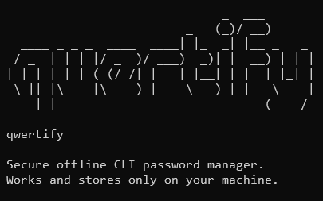

# qwertify
A simple yet secure command-line password manager written in Go.


## Features
- Data is stored locally in encrypted `~/.qwertify/vault.json`.
- AES-256-GCM, scrypt, bcrypt.
- Clipboard support.
## Install
**Go 1.24.4 or later** is required!
```
go install github.com/temaelkin/qwertify/cmd/qwfy@latest
```
## Usage
```
# Make a good master password!
# You will need it more than once

1. qwfy init           Initialize a new vault
2. qwfy add <url>      Add a new entry
3. qwfy get <url>      Retrieve an entry
4. qwfy edit <url>     Edit an existing entry
5. qwfy del <url>      Delete an entry
6. qwfy all            List all entries
7. qwfy help           Show help
```
## Work In Progress
I work on qwertify as a pet-project when I have some free time and right mood so the process is pretty slow but I do have some plans for it. One day it will become a convenient tool for managing your passwords :)
```
Gonna add:
1. TUI (tview or bubbletea)
2. Password generation
& huge refactoring
```
## WARNING
I really do not recommend using qwertify as your main password manager RIGHT NOW since the current state is unfinished and requires a lot of work to be done.\
But feel free to try it anyway.

---
## License
[MIT](https://github.com/temaelkin/qwertify/blob/main/LICENSE)
